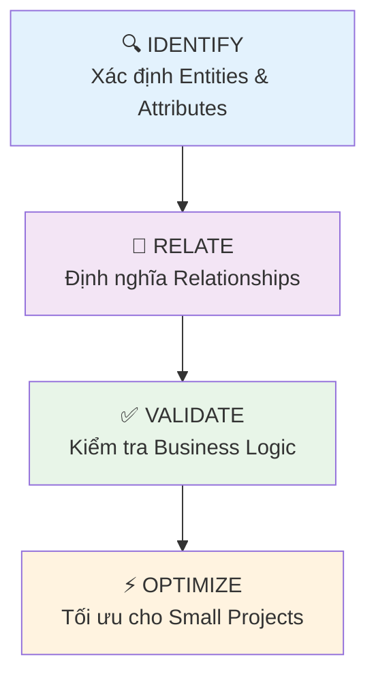
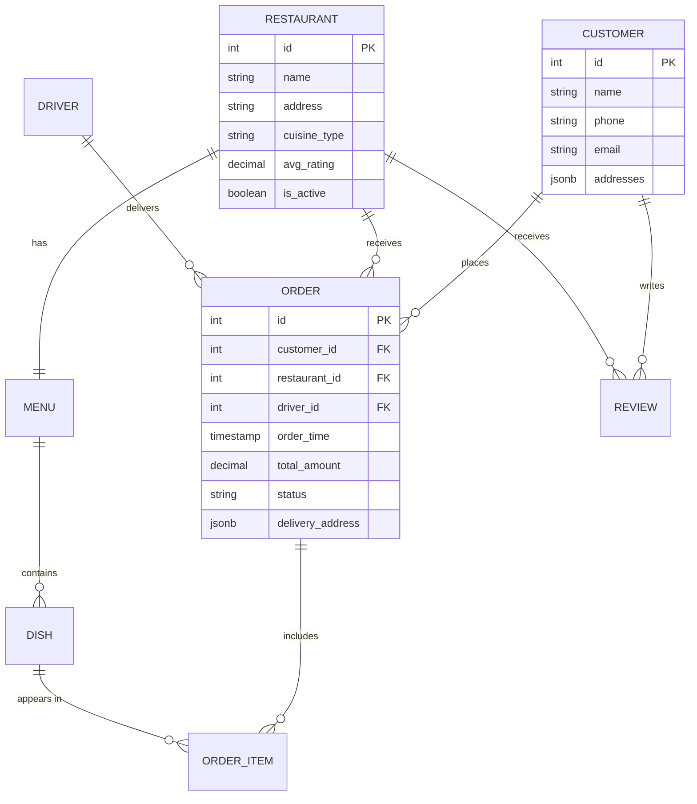

# Thiết kế Lược đồ Quan hệ & Sơ đồ ERD – Đề cương Buổi Đào tạo (60 phút)

---
### **Giải thích phần tiêu đề**
*Buổi học này trang bị cho học viên kỹ năng quan trọng nhất trong database design: **chuyển đổi từ ý tưởng business thành cấu trúc database cụ thể**. Đây là cầu nối giữa nguyên tắc lý thuyết và implementation thực tế, giúp full-stack developers có thể tự tin thiết kế database cho các dự án startup và SME.*

**Đối tượng học viên:**
Full-stack developers với 1+ năm kinh nghiệm trong Node.js/NestJS/Next.js stack, đã nắm vững các nguyên tắc thiết kế database cơ bản, muốn học cách **phân tích requirements** và **vẽ ERD chuyên nghiệp** cho dự án thực tế.

**Mục tiêu buổi học:**
- **Thành thạo quy trình phân tích** yêu cầu business để xác định entities và relationships
- **Vẽ được ERD chuyên nghiệp** với các công cụ hiện đại (draw.io, dbdiagram.io)
- **Phân biệt và triển khai** đúng các loại quan hệ 1-1, 1-n, n-n trong PostgreSQL
- **Áp dụng nguyên tắc small & medium projects** vào việc thiết kế schema thực tế
- **Review và cải thiện** ERD existing để tối ưu cho maintainability và performance

---

## 1. Dẫn nhập (15 phút)

### **1.1. Khởi động & Câu hỏi mở**
*Chào mọi người! Hãy nâng tay lên nếu bạn đã từng gặp tình huống này:*
- **"Làm feature mới nhưng phát hiện thiếu bảng quan trọng?"** *(Pause để học viên phản hồi)*
- **"Muốn join 2 bảng nhưng không biết làm sao vì thiếu foreign key?"** 
- **"Nhìn vào database của dự án cũ và không hiểu gì cả?"**

*Tất cả những vấn đề này xuất phát từ một nguyên nhân chung: **thiếu bước thiết kế ERD có hệ thống**. Hôm nay chúng ta sẽ học cách biến requirements phức tạp thành database schema rõ ràng, maintainable.*

### **1.2. Câu chuyện dẫn dắt**
**Airbnb's Database Design Crisis (2012):**

*Năm 2012, khi Airbnb đang scale nhanh từ startup nhỏ thành unicorn, họ gặp phải một cuộc khủng hoảng database nghiêm trọng. Vấn đề không phải là traffic quá lớn, mà là **thiết kế database ban đầu quá đơn giản**.*

*Ban đầu, Airbnb chỉ có 3 bảng chính: `users`, `listings`, và `bookings`. Nghe có vẻ hợp lý đúng không? Nhưng khi business phát triển:*
- *Host muốn có nhiều loại property (nhà, phòng, chung cư)*
- *Cần system messaging giữa guest và host* 
- *Reviews 2 chiều (guest review host, host review guest)*
- *Pricing dynamic theo season, location, demand*
- *Payment processing với nhiều currency*

*Database engineer của Airbnb kể lại: **"Chúng tôi đã dành 6 tháng để refactor lại toàn bộ database schema vì thiếu bước phân tích relationship từ đầu. Nếu có ERD rõ ràng từ ngày đầu, chúng tôi đã tiết kiệm được hàng triệu dollar và 6 tháng development time."***

*Điều này chứng minh: **Good ERD design is not optional - it's a survival skill for growing startups.***

### **1.3. Ví dụ hấp dẫn**
**Instagram's Genius ERD Decision:**

*Khi Instagram launch năm 2010, team chỉ có 2 engineers, nhưng họ đã thiết kế ERD cho **100 triệu users** ngay từ đầu. Quyết định thiết kế xuất sắc nhất?*

**Họ tách bảng `photos` và `users` hoàn toàn độc lập:**
```sql
-- Thay vì design naïve này:
users: id, username, email, profile_photo_url

-- Họ design thế này:
users: id, username, email
photos: id, user_id, url, created_at
user_profiles: user_id, profile_photo_id
```

*Kết quả? Khi Facebook mua Instagram với **1 tỷ USD**, entire database chỉ cần **3 servers** để handle 100M+ users. **Database design tốt = chi phí infrastructure thấp = valuation cao hơn.***

*Hôm nay, chúng ta sẽ học cách thiết kế ERD như Instagram team - **simple nhưng scalable**.*

### **1.4. Giới thiệu chủ đề**
*"Hôm nay chúng ta sẽ master về **ERD Design Process** - cách chuyển từ business requirements mơ hồ thành database schema rõ ràng. Chúng ta sẽ học quy trình 4 bước: **IDENTIFY → RELATE → VALIDATE → OPTIMIZE** và practice với case study thực tế của một food delivery startup. Cuối buổi, mọi người sẽ có thể tự tin design ERD cho bất kỳ dự án small/medium nào."*

---

## 2. Nguyên tắc & Quy trình cốt lõi (20 phút)

### **2.1. Quy trình 4 Bước Thiết kế ERD**



#### **🔍 Bước 1: IDENTIFY - Xác định Entities & Attributes**

**Technique: Noun & Verb Analysis**
- **Đọc requirements, highlight tất cả NOUNS** → potential entities
- **Highlight tất cả VERBS** → potential relationships  
- **Classify attributes:** Required vs Optional, Unique vs Non-unique

**Ví dụ với Food Delivery App:**
> *"**Customers** can **place** multiple **orders**. Each **order** contains multiple **dishes** from one **restaurant**. **Restaurants** have **menus** with **categories**. **Delivery drivers** can **accept** and **deliver** orders."*

**Entities identified:**
- **Customer** *(attributes: name, phone, email, address)*
- **Order** *(order_date, total_amount, status, delivery_address)*
- **Dish** *(name, price, description, image_url)*
- **Restaurant** *(name, address, phone, cuisine_type)*
- **Menu** *(name, description)*
- **Category** *(name, sort_order)*
- **Driver** *(name, phone, license_number, vehicle_type)*

#### **🔗 Bước 2: RELATE - Định nghĩa Relationships**

**3 Loại Quan hệ Cơ bản:**

| Loại | Ký hiệu ERD | Ví dụ Business | Implementation |
|------|-------------|----------------|----------------|
| **1:1** | `─────────` | User ↔ Profile | FK ở một bảng |
| **1:n** | `─────<───` | Restaurant → Orders | FK ở bảng "many" |
| **n:n** | `───<>───` | Orders ↔ Dishes | Junction table |

**Chi tiết Implementation:**

**1:1 Relationship:**
```sql
-- User has ONE profile (optional)
CREATE TABLE users (
    id SERIAL PRIMARY KEY,
    username VARCHAR(50) UNIQUE
);

CREATE TABLE user_profiles (
    user_id INT PRIMARY KEY REFERENCES users(id),
    bio TEXT,
    avatar_url VARCHAR(255)
);
```

**1:n Relationship:**
```sql
-- Restaurant has MANY orders
CREATE TABLE restaurants (
    id SERIAL PRIMARY KEY,
    name VARCHAR(100)
);

CREATE TABLE orders (
    id SERIAL PRIMARY KEY,
    restaurant_id INT NOT NULL REFERENCES restaurants(id),
    order_date TIMESTAMP DEFAULT NOW()
);
```

**n:n Relationship:**
```sql
-- Order contains MANY dishes, Dish appears in MANY orders  
CREATE TABLE orders (
    id SERIAL PRIMARY KEY,
    customer_id INT NOT NULL
);

CREATE TABLE dishes (
    id SERIAL PRIMARY KEY,
    name VARCHAR(100),
    price DECIMAL(8,2)
);

-- Junction table
CREATE TABLE order_items (
    order_id INT REFERENCES orders(id),
    dish_id INT REFERENCES dishes(id),
    quantity INT NOT NULL,
    unit_price DECIMAL(8,2),
    PRIMARY KEY (order_id, dish_id)
);
```

#### **✅ Bước 3: VALIDATE - Kiểm tra Business Logic**

**Validation Checklist:**
- ✅ **Referential Integrity:** Mọi FK đều có corresponding PK
- ✅ **Business Rules:** Schema có support được business constraints?
- ✅ **Data Consistency:** Không có redundant data không kiểm soát được
- ✅ **Query Patterns:** Common queries có efficient không?

**Common Validation Questions:**
1. *"Nếu xóa restaurant, orders related có bị orphaned không?"*
2. *"Customer có thể đặt order từ nhiều restaurant cùng lúc không?"*
3. *"Driver có thể deliver nhiều order cùng lúc không?"*
4. *"Menu items có thể temporarily out of stock không?"*

#### **⚡ Bước 4: OPTIMIZE - Tối ưu cho Small Projects**

**Optimization cho Context Small/Medium:**

**Denormalization có Kiểm soát:**
```sql
-- Thay vì join để lấy restaurant name mỗi lần
-- Store restaurant_name trực tiếp trong orders table
ALTER TABLE orders ADD COLUMN restaurant_name VARCHAR(100);

-- Trade-off: Faster reads, slower writes khi restaurant đổi tên
```

**JSON Fields cho Flexibility:**
```sql
-- Thay vì tạo nhiều bảng cho metadata
ALTER TABLE orders ADD COLUMN delivery_preferences JSONB;

-- Example data:
-- {"special_instructions": "Leave at door", "preferred_time": "12:00-13:00"}
```

**Strategic Indexing:**
```sql
-- Index only những columns thường query
CREATE INDEX idx_orders_customer_id ON orders(customer_id);
CREATE INDEX idx_orders_status_date ON orders(status, order_date);

-- Tránh over-indexing trong phase đầu
```

### **2.2. Tools & Best Practices**

#### **Công cụ vẽ ERD Recommended:**

**1. dbdiagram.io** *(Most suitable cho developers)*
```sql
-- Syntax đơn giản, familiar với SQL
Table customers {
  id int [pk, increment]
  name varchar(100) [not null]
  email varchar(255) [unique]
}

Table orders {
  id int [pk, increment] 
  customer_id int [ref: > customers.id]
  order_date timestamp [default: `now()`]
}
```

**2. draw.io** *(Flexible, miễn phí)*
- Template sẵn có cho ERD
- Export được nhiều format
- Collaboration real-time

**3. VS Code Extensions:**
- **ERD Editor:** Code-based ERD design
- **Database Client:** Reverse engineer từ existing DB

#### **ERD Best Practices cho Small/Medium Projects:**

1. **Keep it Simple Initially:**
   - Bắt đầu với core entities (3-5 tables)
   - Gradually add complexity
   - Avoid over-engineering từ đầu

2. **Naming Conventions:**
   ```sql
   -- Table names: plural, lowercase, underscore
   customers, order_items, menu_categories
   
   -- Column names: singular, descriptive
   customer_id, created_at, total_amount
   
   -- Foreign keys: [referenced_table]_id
   customer_id, restaurant_id, dish_id
   ```

3. **Documentation trong ERD:**
   - Business rules as notes
   - Constraints explanations  
   - Example data cho clarity

---

## 3. Áp dụng thực tế & Case studies (15 phút)

### **3.1. Case Study: Food Delivery MVP**

**Business Requirements:**
> *"Chúng ta cần MVP cho food delivery app như Grab Food. Customers có thể browse restaurants, đặt dishes từ menu, track order status, và rate restaurants sau khi ăn. Restaurants có thể manage menu và update order status. Drivers nhận orders và update delivery status."*

**Thực hành Design Process:**

#### **Step 1: IDENTIFY Entities**
```
Primary Entities:
├── Customer (name, phone, email, addresses[])
├── Restaurant (name, address, cuisine_type, rating) 
├── Menu (restaurant_id, name, description)
├── Dish (menu_id, name, price, image, available)
├── Order (customer_id, restaurant_id, status, total)
├── OrderItem (order_id, dish_id, quantity, price)
├── Driver (name, phone, vehicle_info, status)
└── Review (customer_id, restaurant_id, rating, comment)
```

#### **Step 2: RELATE Entities**


#### **Step 3: VALIDATE Business Logic**

**Critical Questions & Solutions:**
1. **Q:** *"Customer có thể đặt từ nhiều restaurant trong 1 order không?"*
   **A:** *Không. Business rule: 1 order = 1 restaurant. Tách ra multiple orders nếu cần.*

2. **Q:** *"Dish price có thể thay đổi. Order history thì sao?"*
   **A:** *Store `unit_price` trong `order_items` table để preserve historical pricing.*

3. **Q:** *"Driver có thể handle bao nhiêu orders cùng lúc?"*
   **A:** *Start với 1:1, sau đó extend với `delivery_batch` table nếu cần.*

#### **Step 4: OPTIMIZE cho MVP Context**

**MVP Optimizations:**
```sql
-- 1. Denormalize restaurant name vào orders để display nhanh
ALTER TABLE orders ADD COLUMN restaurant_name VARCHAR(100);

-- 2. JSONB field cho flexible address storage
ALTER TABLE customers ADD COLUMN addresses JSONB;
-- Example: [{"type": "home", "address": "123 Main St", "default": true}]

-- 3. Strategic indexes cho common queries
CREATE INDEX idx_orders_customer_status ON orders(customer_id, status);
CREATE INDEX idx_dishes_menu_available ON dishes(menu_id, is_available);

-- 4. Simple rating system
ALTER TABLE restaurants ADD COLUMN avg_rating DECIMAL(2,1) DEFAULT 0;
-- Update via trigger or background job
```

### **3.2. Anti-patterns to Avoid**

#### **❌ Over-normalization trong MVP**
```sql
-- DON'T: Tạo quá nhiều bảng lookup từ đầu
CREATE TABLE cuisines (id, name);
CREATE TABLE dish_categories (id, name);  
CREATE TABLE order_statuses (id, name);

-- DO: Start simple, extract later khi stable
ALTER TABLE restaurants ADD COLUMN cuisine_type VARCHAR(50);
ALTER TABLE dishes ADD COLUMN category VARCHAR(50);
ALTER TABLE orders ADD COLUMN status VARCHAR(20);
```

#### **❌ Missing Junction Table Information**
```sql
-- DON'T: Chỉ store relationship
CREATE TABLE order_dishes (
    order_id INT,
    dish_id INT
);

-- DO: Store business context
CREATE TABLE order_items (
    order_id INT,
    dish_id INT,
    quantity INT NOT NULL,
    unit_price DECIMAL(8,2) NOT NULL, -- Historical pricing!
    special_instructions TEXT
);
```

### **3.3. Modern Stack Integration**

#### **ERD → Prisma Schema Translation**
```prisma
// From ERD design to Prisma implementation
model Customer {
  id        Int      @id @default(autoincrement())
  name      String   @db.VarChar(100)
  email     String   @unique
  phone     String?
  addresses Json?    // JSONB field
  
  orders    Order[]
  reviews   Review[]
  
  @@map("customers")
}

model Order {
  id           Int      @id @default(autoincrement())
  customerId   Int      @map("customer_id")
  restaurantId Int      @map("restaurant_id")
  driverId     Int?     @map("driver_id")
  orderTime    DateTime @default(now()) @map("order_time")
  totalAmount  Decimal  @db.Decimal(8, 2) @map("total_amount")
  status       String   @default("pending")
  
  customer     Customer @relation(fields: [customerId], references: [id])
  restaurant   Restaurant @relation(fields: [restaurantId], references: [id])
  driver       Driver?   @relation(fields: [driverId], references: [id])
  orderItems   OrderItem[]
  
  @@map("orders")
}
```

---

## 4. Thảo luận mở & Workshop mini (7 phút)

### **Workshop: ERD Design Challenge**

**Scenario:** *Bạn được giao thiết kế database cho **Online Learning Platform** (như Udemy). Students có thể enroll courses, watch videos, submit assignments, và receive certificates.*

#### **Câu hỏi thảo luận:**

1. **Entity Identification:**
   *"Hãy identify 5-7 entities chính và 3 attributes quan trọng nhất cho mỗi entity. Có entities nào bị miss thường xuyên không?"*

   **Gợi ý trả lời:**
   - Core: `Student`, `Course`, `Instructor`, `Video`, `Assignment`
   - Often missed: `Enrollment` (junction với additional data), `Certificate`, `Progress`
   - Key attributes: IDs, timestamps, status fields, business identifiers

2. **Complex Relationships:**
   *"Course có thể có multiple instructors, student có thể enroll multiple courses. Progress tracking theo từng video. Làm sao design relationships cho efficient querying?"*

   **Gợi ý trả lời:**
   - `Course ←→ Instructor`: n:n qua `course_instructors`
   - `Student ←→ Course`: n:n qua `enrollments` (có enrollment_date, completion_status)
   - `Progress`: 3-way relationship (student_id, video_id, progress_percentage)

3. **Small Project Trade-offs:**
   *"MVP với 100 students, 10 courses. Bạn sẽ optimize gì để launch nhanh mà vẫn scale được khi có 10K students?"*

   **Gợi ý trả lời:**
   - Start với separate `progress` table, không denormalize ngay
   - JSONB cho course `metadata` (syllabus, requirements)
   - Strategic indexes: `enrollments(student_id, status)`, `videos(course_id, sort_order)`
   - Avoid complex reporting tables ở phase MVP

**Interactive Exercise (2 phút):**
*Mọi người hãy vẽ nhanh ERD cho 3 entities chính và relationships. Người nào muốn share screen và explain design decision của mình?*

---

## 5. Tóm tắt (3 phút)

### **5.1. Tổng kết các nguyên tắc chính**
- **ERD Process:** IDENTIFY → RELATE → VALIDATE → OPTIMIZE  
- **Relationships:** 1:1 (FK ở một bảng), 1:n (FK ở bảng "many"), n:n (junction table)
- **Small Project Strategy:** Simple first, strategic optimization, avoid over-engineering
- **Tools:** dbdiagram.io cho speed, draw.io cho flexibility

### **5.2. Nhấn mạnh mindset cốt lõi**
**"Good ERD is not about perfection - it's about clarity và adaptability. Design cho team hiểu và business grow."**

### **5.3. Cầu nối đến bài học tiếp theo**
*"Hôm nay chúng ta đã học thiết kế ERD - the blueprint. Buổi tới sẽ học performance optimization: indexing, query tuning, và load testing để ERD design của chúng ta handle được traffic thực tế. Từ paper design đến production-ready database!"*

---

## 6. Tài liệu tham khảo & Next steps

### **Tools và Resources:**
- **dbdiagram.io:** Online ERD design với SQL syntax
- **draw.io:** Template ERD miễn phí, export đa format  
- **VS Code ERD Editor:** Code-based ERD design
- **Prisma ERD Generator:** Auto-generate ERD từ schema.prisma

### **Practice Exercises:**
- **Exercise 1:** Design ERD cho E-commerce platform (Product, Customer, Order, Category, Review)
- **Exercise 2:** Social Media Platform (User, Post, Comment, Like, Follow)  
- **Exercise 3:** Reverse engineer ERD từ existing application API

### **Advanced Reading:**
- "Database Design for Mere Mortals" - Michael Hernandez
- "Learning SQL" - Alan Beaulieu  
- Prisma Documentation: Schema Design Best Practices
- PostgreSQL Documentation: Table Design Guidelines 