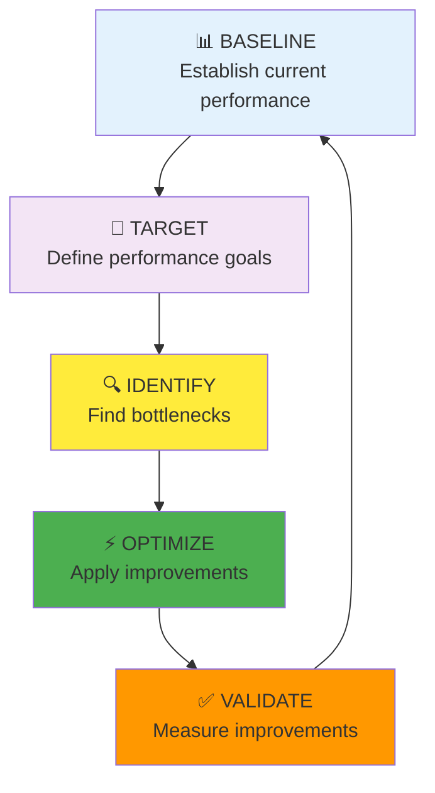
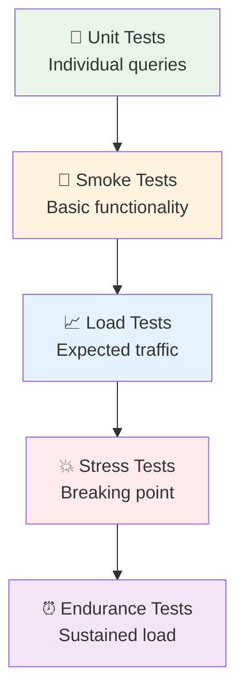

# Tối ưu Hiệu suất & Kiểm thử Database – Đề cương Buổi Đào tạo (60 phút)

---
### **Giải thích phần tiêu đề**
*Buổi học này chuyển từ thiết kế lý thuyết sang **production-ready performance**. Học viên sẽ học cách đánh giá, tối ưu và kiểm thử database để đảm bảo hệ thống có thể handle traffic thực tế. Đây là kỹ năng then chốt để database design không chỉ đẹp trên giấy mà còn hoạt động mượt mà trong thực tế.*

**Đối tượng học viên:**
Full-stack developers đã nắm vững ERD design, muốn học cách **optimize database performance** cho production environment. Đặc biệt phù hợp với những người chuẩn bị launch sản phẩm hoặc đang gặp performance issues trong dự án hiện tại.

**Mục tiêu buổi học:**
- **Đánh giá performance** database thông qua các metrics quan trọng
- **Thành thạo indexing strategy** để tối ưu query speed
- **Áp dụng load testing** với công cụ chuyên dụng 
- **Cân bằng trade-offs** giữa normalization và performance
- **Troubleshoot** các vấn đề performance phổ biến trong production

---

## 1. Dẫn nhập (15 phút)

### **1.1. Khởi động & Câu hỏi mở**
*Ai đã từng gặp những tình huống này trong production:*
- **"Website chạy ngon ở local nhưng chậm như rùa khi có user thật?"** *(Pause để nghe phản hồi)*
- **"Query đơn giản nhưng mất 5-10 giây để trả kết quả?"**
- **"Database CPU spike lên 100% mỗi khi có traffic cao?"**

*Đây chính là những dấu hiệu của **database performance bottlenecks**. Hôm nay chúng ta sẽ học cách identify, measure và fix những vấn đề này một cách systematic.*

### **1.2. Câu chuyện dẫn dắt**
**Stack Overflow's 25-Second Query Crisis (2008):**

*Năm 2008, Stack Overflow - website Q&A lớn nhất cho developers - gặp phải một cuộc khủng hoảng performance nghiêm trọng. **Một query đơn giản để load homepage mất tới 25 giây!***

*Vấn đề? Database có 50 triệu records nhưng **không có index nào** trên các cột thường xuyên query. Jeff Atwood (co-founder) kể lại:*

> *"Chúng tôi đã thiết kế schema rất đẹp, normalized hoàn hảo, nhưng quên mất performance. Một query JOIN 4 bảng để hiển thị danh sách câu hỏi phải scan qua 50 triệu rows mỗi lần."*

**Giải pháp của họ:**
1. **Strategic indexing:** Thêm composite indexes cho common query patterns
2. **Denormalization có kiểm soát:** Pre-calculate view counts, vote scores
3. **Query optimization:** Rewrite expensive JOINs thành efficient lookups

**Kết quả:** *Query time giảm từ 25 giây xuống **50 milliseconds** - cải thiện 500 lần!*

*Stack Overflow hiện handle **6,000 requests/second** với chỉ 9 database servers. **Performance optimization tốt = infrastructure cost thấp = business success.***

### **1.3. Ví dụ hấp dẫn**
**Discord's Database Scaling Magic:**

*Discord phục vụ **150 triệu active users** với database architecture cực kỳ thông minh. Bí mật của họ không phải là hardware đắt tiền, mà là **performance optimization strategies**:*

**Message Storage Optimization:**
```sql
-- Thay vì store tất cả messages trong 1 bảng khổng lồ
CREATE TABLE messages_2024_01 (...);  -- Partition by month
CREATE TABLE messages_2024_02 (...);  

-- Với strategic indexes:
CREATE INDEX idx_messages_channel_timestamp 
ON messages_2024_01 (channel_id, created_at DESC);
```

**Kết quả ấn tượng:**
- **Truy vấn message history:** < 10ms response time
- **Database size:** 1+ petabyte data
- **Query throughput:** 40,000+ queries/second
- **Infrastructure cost:** 90% thấp hơn so với naive approach

*Discord chứng minh: **Smart performance optimization > Expensive hardware.***

### **1.4. Giới thiệu chủ đề**
*"Hôm nay chúng ta sẽ học **Performance Engineering** cho database - từ việc đo lường metrics quan trọng, thiết kế indexing strategy hiệu quả, đến load testing để đảm bảo hệ thống ready cho production traffic. Chúng ta sẽ practice với tools thực tế và case studies từ những startup đã scale thành công."*

---

## 2. Nguyên tắc & Quy trình cốt lõi (20 phút)

### **2.1. Performance Metrics Framework**

#### **Core Metrics cho Small/Medium Projects:**

| Metric | Ý nghĩa | Target cho SME | Measurement Tool |
|--------|---------|----------------|------------------|
| **Response Time** | Thời gian query execution | < 100ms (p95) | EXPLAIN ANALYZE |
| **Throughput** | Queries per second | > 1,000 QPS | pgbench, Artillery |
| **Resource Usage** | CPU, Memory, I/O | < 70% sustained | pg_stat_activity |
| **Connection Pool** | Active connections | < 80% pool size | Connection monitoring |
| **Cache Hit Ratio** | Buffer cache efficiency | > 95% | pg_stat_database |

#### **Performance Measurement Process:**



### **2.2. Indexing Strategy cho Small/Medium Projects**

#### **Index Types và Use Cases:**

**1. B-Tree Index (Default - 90% cases):**
```sql
-- Single column index cho WHERE clauses
CREATE INDEX idx_orders_customer_id ON orders (customer_id);

-- Composite index cho multiple conditions
CREATE INDEX idx_orders_status_date ON orders (status, order_date DESC);

-- Covering index để avoid table lookups
CREATE INDEX idx_orders_summary ON orders (customer_id, status) 
INCLUDE (total_amount, order_date);
```

**2. Partial Index (Filtered data):**
```sql
-- Chỉ index active records (tiết kiệm space)
CREATE INDEX idx_active_orders ON orders (customer_id, order_date) 
WHERE status IN ('pending', 'processing');

-- Index cho rare conditions
CREATE INDEX idx_failed_payments ON payments (order_id, created_at)
WHERE status = 'failed';
```

**3. Expression Index (Computed values):**
```sql
-- Index cho case-insensitive search
CREATE INDEX idx_customers_email_lower ON customers (LOWER(email));

-- Index cho date calculations
CREATE INDEX idx_orders_month ON orders (EXTRACT(MONTH FROM order_date));
```

#### **Indexing Best Practices cho SME:**

**✅ DO - Strategic Indexing:**
```sql
-- 1. Index foreign keys (luôn luôn)
CREATE INDEX idx_orders_customer_id ON orders (customer_id);
CREATE INDEX idx_order_items_order_id ON order_items (order_id);

-- 2. Index search columns
CREATE INDEX idx_products_name_gin ON products USING GIN (to_tsvector('english', name));

-- 3. Index sort columns
CREATE INDEX idx_orders_date_desc ON orders (order_date DESC);

-- 4. Composite index theo query patterns
-- Query: WHERE customer_id = ? AND status = ? ORDER BY order_date DESC
CREATE INDEX idx_orders_customer_status_date ON orders (customer_id, status, order_date DESC);
```

**❌ DON'T - Over-indexing:**
```sql
-- Tránh index mọi column
CREATE INDEX idx_orders_notes ON orders (notes);  -- Rarely queried
CREATE INDEX idx_customers_created_at ON customers (created_at);  -- No business value

-- Tránh duplicate indexes
CREATE INDEX idx_orders_customer ON orders (customer_id);
CREATE INDEX idx_orders_customer_duplicate ON orders (customer_id, id);  -- Redundant
```

### **2.3. Query Optimization Techniques**

#### **EXPLAIN ANALYZE - Reading Query Plans:**

```sql
-- Analyze slow query
EXPLAIN (ANALYZE, BUFFERS, FORMAT JSON) 
SELECT c.name, COUNT(o.id) as order_count, SUM(o.total_amount) as total_spent
FROM customers c 
LEFT JOIN orders o ON c.id = o.customer_id 
WHERE c.created_at >= '2024-01-01'
GROUP BY c.id, c.name 
ORDER BY total_spent DESC 
LIMIT 10;
```

**Key Indicators trong Query Plan:**
- **Seq Scan:** 🚨 Needs index
- **Index Scan:** ✅ Good
- **Nested Loop:** 🚨 Check join conditions  
- **Hash Join:** ✅ Efficient for large datasets
- **Sort:** 🚨 Consider index for ORDER BY

#### **Common Query Optimization Patterns:**

**1. N+1 Query Problem:**
```sql
-- ❌ BAD: N+1 queries
-- First query: SELECT * FROM orders WHERE customer_id = ?
-- Then N queries: SELECT * FROM customers WHERE id = ? (for each order)

-- ✅ GOOD: Single JOIN query
SELECT o.*, c.name, c.email
FROM orders o
JOIN customers c ON o.customer_id = c.id
WHERE o.order_date >= '2024-01-01';
```

**2. Pagination Optimization:**
```sql
-- ❌ BAD: OFFSET gets slower as page number increases
SELECT * FROM orders ORDER BY id LIMIT 20 OFFSET 10000;

-- ✅ GOOD: Cursor-based pagination
SELECT * FROM orders 
WHERE id > 10020  -- Last ID from previous page
ORDER BY id LIMIT 20;
```

**3. Aggregation Optimization:**
```sql
-- ❌ BAD: Expensive GROUP BY on large table
SELECT customer_id, COUNT(*), SUM(total_amount)
FROM orders 
GROUP BY customer_id;

-- ✅ GOOD: Materialized view or summary table
CREATE MATERIALIZED VIEW customer_stats AS
SELECT customer_id, COUNT(*) as order_count, SUM(total_amount) as total_spent
FROM orders 
GROUP BY customer_id;

-- Refresh periodically
REFRESH MATERIALIZED VIEW customer_stats;
```

### **2.4. Denormalization Strategy cho Performance**

#### **When to Denormalize:**
- **Read-heavy workloads** (10:1 read/write ratio)
- **Expensive JOINs** affecting user experience  
- **Real-time requirements** (< 50ms response time)
- **Reporting queries** với complex aggregations

#### **Controlled Denormalization Examples:**

**1. Customer Name trong Orders:**
```sql
-- Thay vì JOIN để lấy customer name mỗi lần
ALTER TABLE orders ADD COLUMN customer_name VARCHAR(100);

-- Update trigger để maintain consistency
CREATE OR REPLACE FUNCTION update_customer_name_in_orders()
RETURNS TRIGGER AS $$
BEGIN
    UPDATE orders SET customer_name = NEW.name WHERE customer_id = NEW.id;
    RETURN NEW;
END;
$$ LANGUAGE plpgsql;

CREATE TRIGGER trigger_update_customer_name
    AFTER UPDATE OF name ON customers
    FOR EACH ROW EXECUTE FUNCTION update_customer_name_in_orders();
```

**2. Aggregated Data:**
```sql
-- Store calculated values để avoid expensive aggregations
ALTER TABLE restaurants ADD COLUMN avg_rating DECIMAL(2,1) DEFAULT 0;
ALTER TABLE restaurants ADD COLUMN total_orders INT DEFAULT 0;

-- Background job update aggregates
UPDATE restaurants SET 
    avg_rating = (SELECT AVG(rating) FROM reviews WHERE restaurant_id = restaurants.id),
    total_orders = (SELECT COUNT(*) FROM orders WHERE restaurant_id = restaurants.id);
```

**3. JSONB cho Flexible Data:**
```sql
-- Thay vì multiple JOINs cho order details
ALTER TABLE orders ADD COLUMN order_summary JSONB;

-- Example data:
-- {
--   "items": [{"name": "Pizza", "quantity": 2, "price": 25.99}],
--   "restaurant": {"name": "Joe's Pizza", "cuisine": "Italian"},
--   "delivery": {"address": "123 Main St", "estimated_time": "30 mins"}
-- }

-- Query with JSONB
SELECT * FROM orders 
WHERE order_summary->>'restaurant'->>'cuisine' = 'Italian';
```

---

## 3. Áp dụng thực tế & Case studies (15 phút)

### **3.1. Case Study: E-commerce Performance Crisis**

**Scenario:** *E-commerce startup với 10K users, 100K products, 500K orders. Homepage load time tăng từ 200ms lên 5 giây khi traffic tăng 3x.*

#### **Step 1: Performance Diagnosis**

**Slow Query Identification:**
```sql
-- Enable slow query logging
ALTER SYSTEM SET log_min_duration_statement = 1000; -- Log queries > 1s
SELECT pg_reload_conf();

-- Check slow queries
SELECT query, mean_exec_time, calls, total_exec_time
FROM pg_stat_statements 
ORDER BY mean_exec_time DESC 
LIMIT 10;
```

**Found Issues:**
1. **Product search:** 8.5s average (no text search index)
2. **Order history:** 3.2s average (missing composite index)
3. **Category listing:** 2.1s average (N+1 query problem)

#### **Step 2: Optimization Implementation**

**1. Text Search Optimization:**
```sql
-- Add GIN index cho full-text search
ALTER TABLE products ADD COLUMN search_vector tsvector;

UPDATE products SET search_vector = 
    to_tsvector('english', name || ' ' || COALESCE(description, ''));

CREATE INDEX idx_products_search ON products USING GIN (search_vector);

-- Optimized search query
SELECT * FROM products 
WHERE search_vector @@ plainto_tsquery('english', 'wireless headphones')
ORDER BY ts_rank(search_vector, plainto_tsquery('english', 'wireless headphones')) DESC;
```

**2. Order History Optimization:**
```sql
-- Composite index cho common query pattern
CREATE INDEX idx_orders_customer_date_status ON orders (customer_id, order_date DESC, status);

-- Covering index để avoid table lookup
CREATE INDEX idx_orders_summary ON orders (customer_id, order_date DESC) 
INCLUDE (total_amount, status, shipping_address);
```

**3. Category N+1 Fix:**
```sql
-- ❌ Before: N+1 queries
-- SELECT * FROM categories;
-- For each category: SELECT COUNT(*) FROM products WHERE category_id = ?

-- ✅ After: Single query with LEFT JOIN
SELECT c.*, COUNT(p.id) as product_count
FROM categories c
LEFT JOIN products p ON c.id = p.category_id
GROUP BY c.id, c.name, c.description
ORDER BY c.sort_order;
```

#### **Step 3: Results & Metrics**

| Metric | Before | After | Improvement |
|--------|---------|-------|-------------|
| **Homepage Load** | 5.2s | 180ms | **96% faster** |
| **Search Response** | 8.5s | 45ms | **99% faster** |
| **Order History** | 3.2s | 120ms | **96% faster** |
| **Database CPU** | 85% avg | 35% avg | **59% reduction** |
| **Concurrent Users** | 100 max | 500+ stable | **5x capacity** |

### **3.2. Load Testing Strategy**

#### **Progressive Load Testing Approach:**



#### **Tool Setup: Artillery.js cho Database Testing**

**1. Installation & Basic Config:**
```bash
npm install -g artillery
```

**2. Database Load Test Configuration:**
```yaml
# artillery-db-test.yml
config:
  target: 'http://localhost:3000'
  phases:
    # Warm-up phase
    - duration: 60
      arrivalRate: 5
      name: "Warm up"
    # Normal load
    - duration: 300
      arrivalRate: 20
      name: "Normal load"
    # Peak load
    - duration: 120
      arrivalRate: 50
      name: "Peak load"
    # Stress test
    - duration: 60
      arrivalRate: 100
      name: "Stress test"

scenarios:
  - name: "E-commerce user journey"
    weight: 70
    flow:
      - get:
          url: "/api/products?search=laptop"
      - think: 2
      - get:
          url: "/api/products/{{ $randomInt(1, 1000) }}"
      - think: 3
      - post:
          url: "/api/cart/add"
          json:
            product_id: "{{ $randomInt(1, 1000) }}"
            quantity: "{{ $randomInt(1, 3) }}"
      
  - name: "Admin operations"
    weight: 30
    flow:
      - get:
          url: "/api/admin/orders?page={{ $randomInt(1, 10) }}"
      - get:
          url: "/api/admin/analytics/revenue"
```

**3. Run Tests:**
```bash
# Basic load test
artillery run artillery-db-test.yml

# With detailed reporting
artillery run --output report.json artillery-db-test.yml
artillery report report.json
```

#### **pgbench for Database-Specific Testing:**

```bash
# Initialize test database
pgbench -i -s 50 testdb  # Scale factor 50 = ~5M rows

# Custom test script
cat > custom-test.sql << EOF
\set customer_id random(1, 100000)
\set product_id random(1, 10000)
SELECT c.name, COUNT(o.id) as orders 
FROM customers c 
LEFT JOIN orders o ON c.id = o.customer_id 
WHERE c.id = :customer_id 
GROUP BY c.id, c.name;
EOF

# Run performance test
pgbench -c 20 -j 4 -T 300 -f custom-test.sql testdb
```

### **3.3. Production Monitoring Setup**

#### **Key Metrics Dashboard:**

**1. Query Performance Monitoring:**
```sql
-- Create monitoring view
CREATE VIEW slow_queries AS
SELECT 
    query,
    calls,
    total_exec_time,
    mean_exec_time,
    rows,
    100.0 * shared_blks_hit / nullif(shared_blks_hit + shared_blks_read, 0) AS hit_percent
FROM pg_stat_statements 
WHERE mean_exec_time > 100  -- Queries slower than 100ms
ORDER BY mean_exec_time DESC;
```

**2. Connection Monitoring:**
```sql
-- Monitor active connections
SELECT 
    datname,
    usename,
    application_name,
    client_addr,
    state,
    query_start,
    state_change,
    query
FROM pg_stat_activity 
WHERE state = 'active';
```

**3. Index Usage Analysis:**
```sql
-- Find unused indexes
SELECT 
    schemaname,
    tablename,
    indexname,
    idx_tup_read,
    idx_tup_fetch,
    pg_size_pretty(pg_relation_size(indexrelid)) as size
FROM pg_stat_user_indexes 
WHERE idx_tup_read = 0 AND idx_tup_fetch = 0
ORDER BY pg_relation_size(indexrelid) DESC;
```

---

## 4. Thảo luận mở & Workshop mini (7 phút)

### **Workshop: Performance Troubleshooting Challenge**

**Scenario:** *Bạn được gọi để fix performance issue của một Social Media API. Users complain về slow feed loading và timeout errors during peak hours.*

#### **Given Information:**
- **Database:** PostgreSQL với 1M users, 10M posts, 100M likes
- **Symptoms:** Feed loading 8-15 seconds, CPU 90%+ during peak
- **Current query:** 
```sql
SELECT p.*, u.username, u.avatar_url, COUNT(l.id) as like_count
FROM posts p
JOIN users u ON p.user_id = u.id  
LEFT JOIN likes l ON p.id = l.post_id
WHERE p.user_id IN (
    SELECT following_id FROM follows WHERE follower_id = ?
)
ORDER BY p.created_at DESC
LIMIT 20;
```

#### **Câu hỏi thảo luận:**

1. **Performance Diagnosis:**
   *"Nhìn vào query này, bạn thấy những bottlenecks nào? Làm sao để identify root cause?"*

   **Gợi ý trả lời:**
   - **Subquery issue:** IN clause với subquery không efficient
   - **Missing indexes:** Cần indexes cho follows table, posts.created_at
   - **Expensive aggregation:** COUNT(likes) cho mỗi post
   - **N+1 potential:** Avatar loading có thể optimize

2. **Optimization Strategy:**
   *"Với context social media (read-heavy, real-time), bạn sẽ optimize như thế nào? Trade-offs gì cần consider?"*

   **Gợi ý trả lời:**
   - **Denormalize like_count** trong posts table (update via trigger)
   - **Rewrite subquery** thành JOIN với follows table
   - **Add strategic indexes:** composite index cho (follower_id, following_id)
   - **Consider caching:** Redis cho popular feeds

3. **Load Testing Plan:**
   *"Làm sao test performance improvements? Metrics nào quan trọng nhất cho social media?"*

   **Gợi ý trả lời:**
   - **Key metrics:** Feed load time < 500ms, 1000+ concurrent users
   - **Test scenarios:** Peak posting hours, viral content spikes
   - **Tools:** Artillery cho API testing, pgbench cho database load

**Interactive Exercise (3 phút):**
*Mọi người hãy viết optimized version của query trên. Ai muốn share solution và explain reasoning?*

**Sample Optimized Solution:**
```sql
-- Optimized query với denormalized data
SELECT 
    p.id, p.content, p.created_at, p.like_count,  -- Pre-calculated
    u.username, u.avatar_url
FROM posts p
JOIN follows f ON p.user_id = f.following_id
JOIN users u ON p.user_id = u.id
WHERE f.follower_id = ?
ORDER BY p.created_at DESC
LIMIT 20;

-- Required indexes:
-- CREATE INDEX idx_follows_follower_following ON follows (follower_id, following_id);
-- CREATE INDEX idx_posts_user_created ON posts (user_id, created_at DESC);
```

---

## 5. Tóm tắt (3 phút)

### **5.1. Tổng kết các nguyên tắc chính**
- **Performance Framework:** Baseline → Target → Identify → Optimize → Validate
- **Strategic Indexing:** Foreign keys, search columns, sort columns, composite indexes
- **Query Optimization:** Avoid N+1, efficient JOINs, cursor pagination
- **Controlled Denormalization:** Read-heavy workloads, real-time requirements

### **5.2. Nhấn mạnh mindset cốt lõi**
**"Performance optimization is not about premature optimization - it's about measuring first, optimizing strategically, and validating results."**

### **5.3. Cầu nối đến bài học tiếp theo**
*"Hôm nay chúng ta đã học optimize database performance - the engine. Buổi cuối sẽ học triển khai với Prisma ORM và NestJS - bringing everything together into production-ready application. Từ optimized database đến modern API!"*

---

## 6. Tài liệu tham khảo & Next steps

### **Tools và Resources:**
- **Artillery.js:** Load testing cho APIs và databases
- **pgbench:** PostgreSQL performance benchmarking  
- **pg_stat_statements:** Query performance analysis
- **EXPLAIN ANALYZE:** Query execution plan analysis

### **Practice Exercises:**
- **Exercise 1:** Optimize slow queries trong existing project
- **Exercise 2:** Set up comprehensive load testing suite
- **Exercise 3:** Create performance monitoring dashboard

### **Advanced Reading:**
- "PostgreSQL Performance Tuning" - Greg Smith
- "High Performance PostgreSQL" - Gregory Smith
- Artillery.js Documentation: Database Load Testing
- PostgreSQL Documentation: Performance Tips 